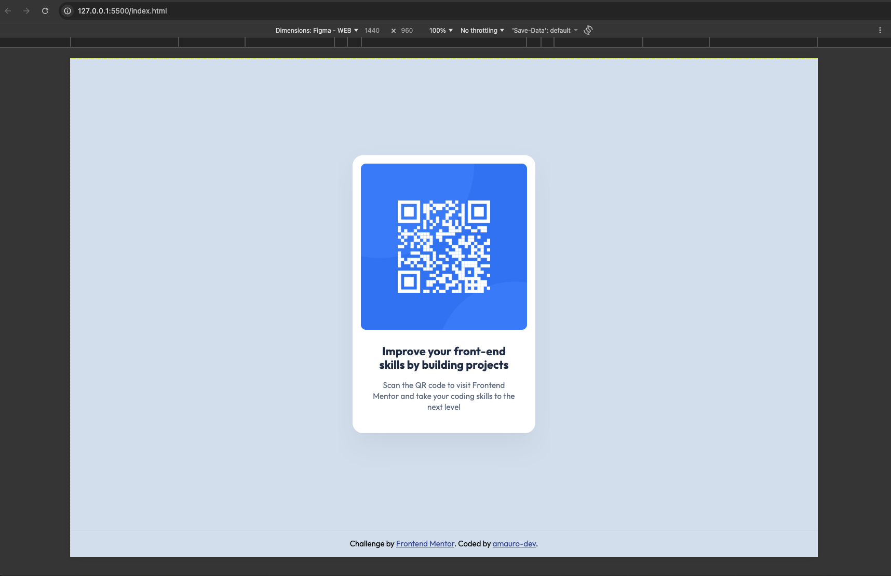
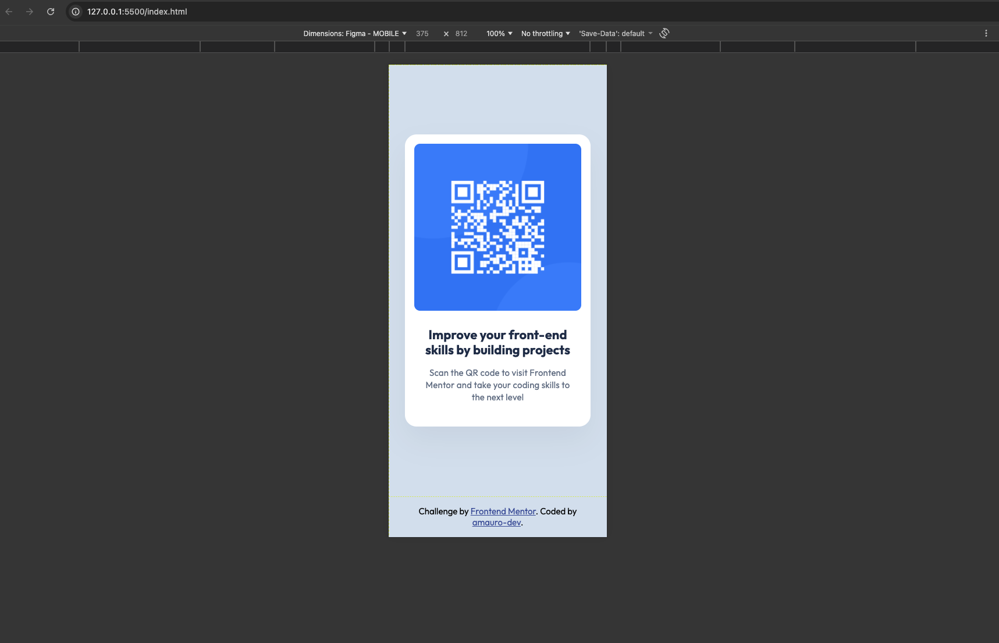

# Frontend Mentor - QR code component solution

This is a solution to the [QR code component challenge on Frontend Mentor](https://www.frontendmentor.io/challenges/qr-code-component-iux_sIO_H). Frontend Mentor challenges help you improve your coding skills by building realistic projects.

## Table of contents

- [Overview](#overview)
  - [Screenshot](#screenshot)
  - [Links](#links)
- [My process](#my-process)
  - [Built with](#built-with)
- [Author](#author)

**Note: Delete this note and update the table of contents based on what sections you keep.**

## Overview

The challenge was to build out a QR code component and get it looking as close to the design as possible.

### Screenshot

### Links

- Solution URL: [GitHub repo](https://github.com/amauro-dev/qr-code-component-main)
- Live Site URL: [Demo](https://amauro-dev.github.io/qr-code-component/)

## My process

### Built with

- Semantic HTML5 markup
- CSS custom properties
- Flexbox

## Author

- Website - [GitHub](https://github.com/amauro-dev)
- Frontend Mentor - [@amauro-dev](https://www.frontendmentor.io/profile/amauro-dev)
- Linkedin - [Andrés Mauro](https://www.linkedin.com/in/andresmauro/)
